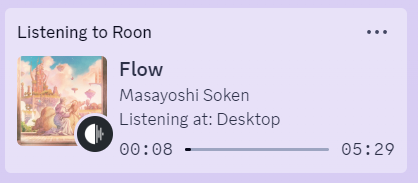
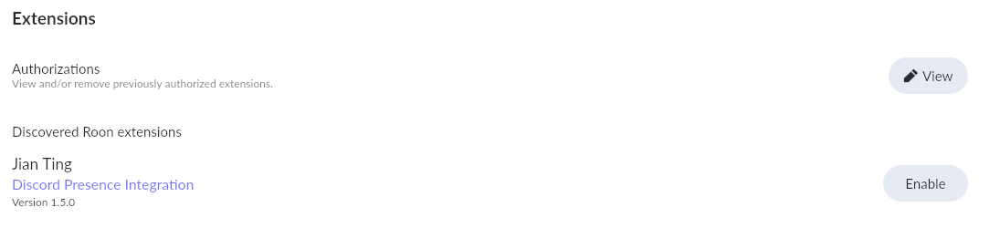
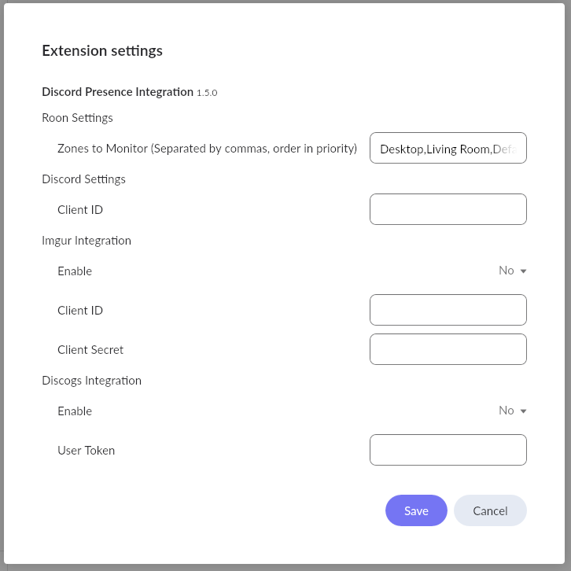

# Discord Presence for Roon


Show what you're listening to on Roon!

This extension allows you to display your currently listening song on your Discord Presence. It can also display album cover by searching through the Discogs database or uploading it to an anonymous Imgur album.

Unfortunately, this script has to be ran on the same instance that a Discord app is running on as it uses Discord RPC.

### Features
- Discogs Database search for Album Covers.
- Imgur Uploads for Album Covers.

### Requirements
- NodeJS
- Discord

### Getting the Script
```bash
git clone https://github.com/jtpox/discord-presence-roon.git
cd discord-presence-roon
```

### Running
```bash
# Run in the folder.
node .
```

### Roon Setup
Open `Roon > Settings > Extensions` and enable `Discord Presence Integration`.



After enabling, click on the `Settings` button and a modal will open. Fill in all the relevant fields and save.



### Discord Settings
You will need to create a new Discord Application through the [Discord Developer Portal](https://discord.com/developers/applications). After creating the application, select the app and go to the settings page for OAuth2.
Copy the `Client ID`.

Edit the Extension Settings and save.

### Album Images
#### Imgur Integration
This feature will upload the album art of the song you are listening to an anonymous Imgur album, which will then be displayed on the Discord presence.

To use this feature, you will need to create an Imgur Application from [here](https://api.imgur.com/oauth2/addclient). Fill in all the fields.
For "Authorization type", select `OAuth2 authorization without a callback URL`.
Copy the `Client ID` and `Client Secret`.

Edit the Extension Settings and save.

#### Discogs Integration
This feature will search through the Discogs database to find the album art to display on the Discord presence.

To use this feature, you will need a Discord personal access token from [here](https://www.discogs.com/settings/developers).

Edit the Extension Settings and save.

#### Prioritization
If both Imgur and Discogs integration are enabled, Imgur will always take priority, while Discogs will not be used.